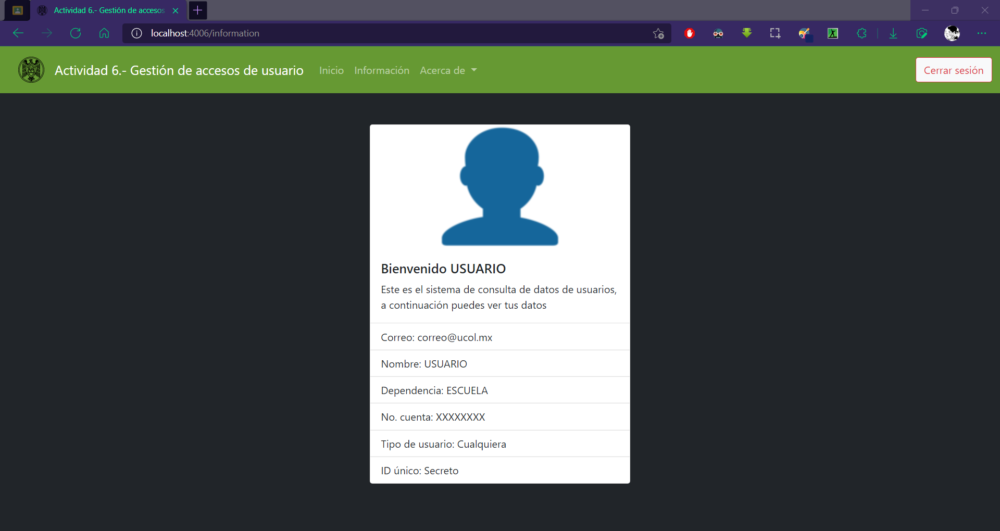

# Actividad 6.- Gestión de accesos de usuario

EQUIPOS

Un control de acceso a sistemas informáticos está basado en tres conceptos fundamentales: identificación, autenticación y autorización.

Existen dos tipos de control de acceso de seguridad informática, que son (a)el control de acceso autónomo y (b)el control de acceso en red.

a).- Los controles de "acceso autónomo" son mecanismos que permiten restringir o administrar de manera segura el acceso físico a un espacio o instalación, como, por ejemplo, una oficina, un ascensor, una caseta de vigilancia o un salón.

Este tipo de control de acceso de seguridad informática operan mediante la introducción de una clave de acceso, una tarjeta magnética o incluso a través del uso de patrones biométricos, como la lectura ocular, el reconocimiento facial o el marcaje de la huella dactilar.

b).- En el caso del control de acceso en red, este funciona de manera integrada por medio de una PC o equipo informático de similares características, el cual puede ser operado de manera local o también remota.

Para ello, debe contarse con un software de control, especialmente desarrollado para llevar un registro efectivo y fidedigno de todas las incidencias que pueden suscitarse, incluyendo fecha y horario de las mismas, además de la identificación de cada usuario.

Desarrollar en cualquier lenguaje o entorno apropiado un control de acceso en red, aplicando la arquitectura asignada por equipo:
- Tradicional aplicando algún esquema bueno y seguro de encriptación, Ej. md5, base64
- Captchas
- Firebase
- Federación

EQUIPO 1 (Captchas)

EQUIPO 2 (Tradicional)

EQUIPO 3 (Firebase)

EQUIPO 4 (Federación)

## Requisitos
- Node.js (>= 16.14.0 LTS)
- Conexión a internet
- Cuenta de la Universidad de Colima
- Puerto local 4006 libre

## Instalación
```
npm install
```

## Iniciar el servidor
```
npm start
npm run dev | (Requiere nodemon)
```

## Previsualización
<p align="center"></p>
<p align="center"></p>